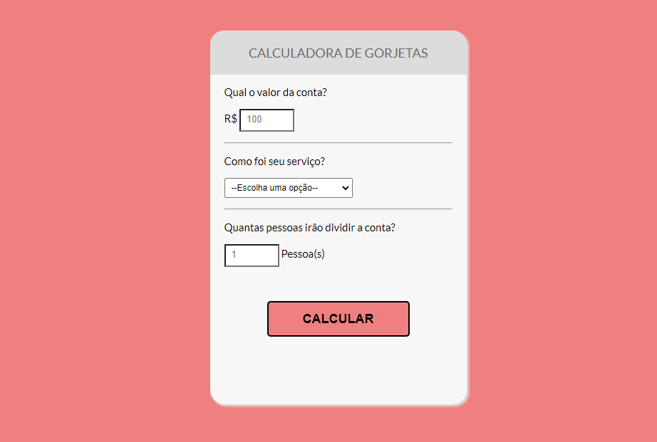

<h1 align="center">Calculadora de gorjetas</h1>

Projeto de uma calculadora, que faz a soma da conta do jantar com a taxa de serviço e divide pelo número de pessoas. Produzido com HTML, CSS e JavaScript.

---

## Funcionalidades
As principais funcionalidades do projeto são:

✅ Poder selecionar qual a taxa de serviço (5%, 10%, 15%, 20%);

✅ Soma da conta com a taxa de serviço escolhida;

✅ Dividir o total da conta com o número de pessoas;

✅ Responsivo em diversos tamanhos de tela.

## Tecnologias
* HTML5
* CSS3
* JavaScript

## Imagens

---

